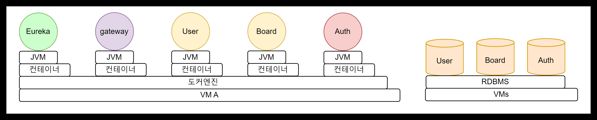
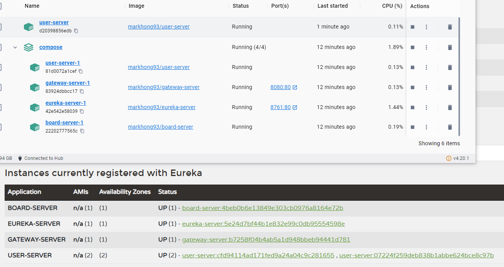
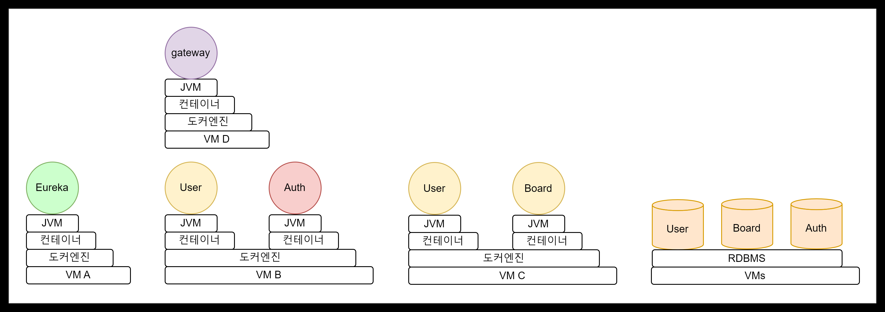

# 사용 기술
- Git
- GitHub
- java 17
- Spring MVC
- Vue.js   
	- axios, webpack, lodash
- MariaDB
---

# 개발 도메인 리스트
## goal 0 : 단위 서비스
1. User
   - User
     - id
     - password
     - name
2. Board
   - Board
     - id
     - name
   - Post
     - id
     - name
3. Auth
   - User
     - id
   - Refresh
     - id
     - refresh
     - last_access

## goal 1: 단일 도커 엔진 MSA

1. Eureka
2. Docker 구성
   - Docker file
   - Docker Compose file

3. 호스트 머신의 DB

## goal 2: 복수 가상 머신의 MSA

1. Docker 포트포워딩

## goal 3: 분산 가상 머신의 MSA
